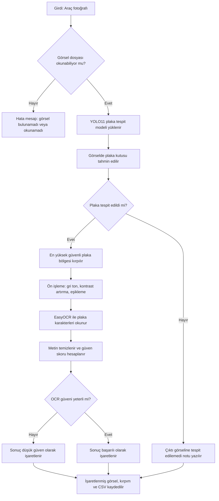

# Derin Öğrenme Tabanlı Araç Plaka Tespit ve Okuma Sistemi

## 1. Proje Adı

Derin Öğrenme Tabanlı Araç Plaka Tespit ve Okuma Sistemi

## 2. Proje Konusu

Bu projenin amacı, bir araç fotoğrafı verildiğinde plaka bölgesini otomatik olarak tespit eden ve tespit edilen plaka üzerindeki karakterleri okuyan bir Python prototipi geliştirmektir. Sistem iki aşamalı tasarlanmıştır: ilk aşamada YOLO tabanlı nesne tespitiyle plaka bölgesi bulunur, ikinci aşamada ise kırpılan plaka görüntüsü EasyOCR ile okunur.

YOLO yaklaşımı, nesne tespitini tek bir sinir ağı geçişinde gerçekleştirdiği için hızlı ve gerçek zamanlı uygulamalara uygundur (Redmon et al., 2016). Plaka tanıma alanında da YOLO tabanlı yöntemlerin farklı görüntü koşullarında etkili sonuçlar verebildiği gösterilmiştir (Laroca et al., 2021).

## 3. GitHub Linki

GitHub public repo linki: `https://github.com/kullanici/plaka-tespit-okuma`

Not: Bu link teslimden önce gerçek public GitHub repo linkiyle değiştirilecektir.

## 4. Yöntem

Projede plaka tespiti için Ultralytics YOLO11n modeli kullanılmıştır. Model, Roboflow Universe üzerindeki License Plate Recognition v11 veri setiyle Kaggle Notebook ortamında eğitilmiştir. Veri seti YOLO formatında indirilmiş ve eğitim sonunda en iyi model ağırlığı `best.pt` olarak alınmıştır.

Plaka okuma aşamasında EasyOCR kullanılacaktır. Tespit edilen plaka bölgesi önce kırpılır, sonra gri tonlama, kontrast artırma ve eşikleme gibi ön işleme adımlarıyla OCR için hazırlanır. EasyOCR sonucunda elde edilen metin büyük harfe çevrilir ve sadece harf/rakam karakterleri kalacak şekilde temizlenir.

## 5. Algoritma Akış Şeması



## 6. Uygulama Tasarımı

Kullanıcı programa bir araç fotoğrafı ve eğitilmiş YOLO ağırlık dosyası verir. Program fotoğrafı okur, plaka bölgesini tespit eder, plakayı kırpar ve OCR işlemini uygular.

Örnek komut:

```bash
python src/main.py --image samples/ornek_arac.jpg --weights models/best.pt --output outputs/demo_result.jpg --csv outputs/results.csv
```

Programın ürettiği çıktılar:

- Plaka kutusu çizilmiş işlenmiş görsel
- Kırpılmış plaka görseli
- Okunan plaka metni
- YOLO tespit güveni ve OCR güven skorunu içeren CSV tablo

## 7. Başarı Ölçütleri

Projenin başarılı sayılması için aşağıdaki ölçütler kullanılacaktır:

- Program verilen görseli okuyabilmelidir.
- YOLO modeli plaka bölgesini doğru veya kabul edilebilir şekilde tespit etmelidir.
- OCR aşaması plaka karakterlerini okunabilir bir metne çevirmelidir.
- En az bir örnek senaryo baştan sona çalıştırılmalıdır.
- Sonuç görsel ve CSV tablo olarak kaydedilmelidir.
- Kaggle eğitiminde validasyon/test metrikleri rapora eklenmelidir.

## 8. Teknik Kısım

Program modüler dosyalardan oluşur:

- `src/detector.py`: YOLO modelini yükler ve plaka kutularını tespit eder.
- `src/preprocess.py`: görsel okuma, plaka kırpma, OCR ön işleme ve metin temizleme işlemlerini yapar.
- `src/ocr_reader.py`: EasyOCR ile plaka metnini okur.
- `src/visualize.py`: tespit sonucunu görsel üzerine çizer.
- `src/main.py`: tüm akışı komut satırından çalıştırır.

Eğitim not defteri `notebooks/plaka_model_egitimi_kaggle.ipynb` dosyasındadır. Bu defterde veri seti indirme, YOLO eğitimi, doğrulama, test ve örnek tahmin adımları bulunur.

## 9. Örnek Senaryo

1. Kullanıcı `samples/ornek_arac.jpg` dosyasını proje klasörüne ekler.
2. Kaggle eğitiminden indirilen `best.pt` dosyasını `models/best.pt` olarak kaydeder.
3. `python src/main.py --image samples/ornek_arac.jpg --weights models/best.pt --output outputs/demo_result.jpg --csv outputs/results.csv` komutunu çalıştırır.
4. Program plaka kutusunu işaretler, plaka kırpımını `outputs/crops/` klasörüne kaydeder ve sonucu `outputs/results.csv` tablosuna yazar.

## 10. Sonuçlar

Model eğitimi Kaggle Notebook ortamında iki adet Tesla T4 GPU ile tamamlanmıştır. Eğitimde YOLO11n modeli kullanılmış, eğitim çıktıları `docs/egitim_ciktilari/` klasörüne alınmış ve en iyi model ağırlığı `models/best.pt` olarak kaydedilmiştir.

Eğitim ve test sonuçları:

- Eğitim epoch sayısı: 30
- Eğitim süresi: yaklaşık 0.749 saat
- Validasyon precision: 0.987
- Validasyon recall: 0.941
- Validasyon mAP50: 0.9685
- Validasyon mAP50-95: 0.6872
- Test mAP50: 0.9693
- Test mAP50-95: 0.6893

Eğitim çıktıları:

- `docs/egitim_ciktilari/results.csv`
- `docs/egitim_ciktilari/results.png`
- `docs/egitim_ciktilari/confusion_matrix.png`
- `docs/egitim_ciktilari/BoxPR_curve.png`
- `docs/egitim_ciktilari/val_batch0_pred.jpg`

Modelin validasyon ve test metrikleri, plaka tespit aşamasının başarılı çalıştığını göstermektedir.

Gerçek araç fotoğrafı ile demo sonucu:

- Kullanılan görsel: `samples/ornek_arac.jpg`
- YOLO tespit güven skoru: 0.7918
- OCR ile okunan plaka: 34B5592
- OCR güven skoru: 0.8989
- Demo durumu: başarılı

Demo çıktıları:

- `outputs/demo_result.jpg`
- `outputs/crops/ornek_arac_plate_crop.jpg`
- `outputs/results.csv`

## 11. Kaynakça

JaidedAI. (2024). *EasyOCR: Ready-to-use OCR with 80+ supported languages*. GitHub. https://github.com/JaidedAI/EasyOCR

Laroca, R., Zanlorensi, L. A., Gonçalves, G. R., Todt, E., Schwartz, W. R., & Menotti, D. (2021). An efficient and layout-independent automatic license plate recognition system based on the YOLO detector. *IET Intelligent Transport Systems, 15*(4), 483-503. https://doi.org/10.1049/itr2.12030

Redmon, J., Divvala, S., Girshick, R., & Farhadi, A. (2016). You only look once: Unified, real-time object detection. *Proceedings of the IEEE Conference on Computer Vision and Pattern Recognition*, 779-788. https://doi.org/10.1109/CVPR.2016.91

Roboflow Universe Projects. (2025). *License Plate Recognition Dataset v11*. Roboflow Universe. https://universe.roboflow.com/roboflow-universe-projects/license-plate-recognition-rxg4e/dataset/11

Ultralytics. (2026). *Ultralytics YOLO documentation*. https://docs.ultralytics.com/
